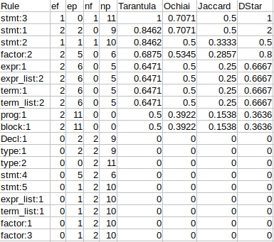

## antlr with default error correction

## Building

To build the project, we just need to a little bit of work (I know its annoying), since the tool uses the following maven plugins:

### antlr4 maven plugin
The grammar under test should be located under `src/main/antlr4/za/ac/sun/cs/localizer` as required by the antlr4 maven plugin. For now, to point the plugin to grammar file, add the .g4 grammar file under include tag in the pom file. For example, for an antlr grammar that describes a small toy programming language: 

```
grammar sletoy;

prog : 'program'  ID '=' block '.' EOF ;

block :  '{' (decl ';')* (stmt ';')* '}';

decl :   'var' ID ':' type ;

type :  'bool' | 'int';

stmt: 'sleep'
    | 'if' expr 'then' stmt 'else' stmt
    | 'while' expr 'do' block 
    |  ID '=' expr
    |  block
    ;

expr: term expr_list ;

expr_list: '=' factor expr_list  | ;

term : factor term_list   ;

term_list: '+' factor term_list  |  ;

factor : '(' expr ')' | ID | NUM ;

ID :  [a-zA-Z][a-zA-Z0-9_]* ;

NUM  : [0-9]+ ;

WS  : [ \n\r\t]+ -> skip;
```
We configure the pom file as follows. We simply add sletoy.g4 inside the include tags ```<include>sleytoy.g4</include>``` as shown in extract below:

```
<project>
...
            <plugin>
                <groupId>org.antlr</groupId>
                <artifactId>antlr4-maven-plugin</artifactId>
                <version>4.7.2</version>
                <configuration>
                    ....
                    <includes>
                        <include>sletoy.g4</include>
                    </includes>		
                    <arguments>
                        <argument>-package</argument>
                        <argument>za.ac.sun.cs.localizer.dynamic</argument>
                    </arguments>
                    
                    <options>
                        <contextSuperClass>RuleContextWithAltNum</contextSuperClass>
                    </options>
                    ...
                </configuration>
                ...
           </plugin>
...
</project>
```

### stringtemplate plugin 
This is not the official stringtemplate maven plugin. Since to integrate antlr generated code in any application, one needs to create lexer and parser objects, and specify the rule to begin parsing from which may differ from grammar to grammar. We use stringtemplate to generate this boilerplate code. This project comes with two template files Testrunner.stg and listener.stg found  in ```src/main/resources/templates```. Testrunner.stg generated a standard pipeline (reading from input stream, creating lexer, creating buffer ,creating a parser and specifies where parsing should begin). listener.stg generates logging code that extends generated listeners. Therefore, provide the following to the plugin: 
1. For Testrunner.stg (example shown in extract below)
  - parserName : the name of the grammar name 
  - startRule : the rule to start parsing from, preferably the start rule 
  - extension : file extension of test files 


```
<project>
...

            <plugin>
                <groupId>za.ac.sun.cs</groupId>
                <artifactId>ST4-maven-plugin</artifactId>
                <version>1.0-SNAPSHOT</version>
                <configuration>
                <templates>
                        <template>
                            <templateFile>driver.stg</templateFile>
                            <target>driver</target>
                            <generatedClassName>TestRunner</generatedClassName>
                            <properties>                                        
                                <packageName>za.ac.sun.cs.localizer.dynamic</packageName>
                                <parserName>sletoy</parserName>
                                <startRule>prog</startRule>
                                <extension>sletoy</extension>
                            </properties>
                    </template>
```
2. listener.stg
 - parserName : the name of the grammar file. Uses this to know the name of the generated listener.
```

                    <template>
                        <templateFile>listener.stg</templateFile>
                        <target>listener</target>
                        <generatedClassName>Spectra</generatedClassName>
                        <properties>
                            <packageName>za.ac.sun.cs.localizer.dynamic</packageName>
                            <parserName>sletoy</parserName>
                        </properties>
                    </template>

                </templates>
                ...
            </plugin>
...
</project>
```

After these configurations, now build the project:

```
bash build.sh
```
## Usage

This tool is used via a simple command-line interface; Note currently we use `pos/` and `neg/` to check whether the result of parsing gives a an expected out i.e.  all tests in pos/ should parse successfully and the parser should bail out on tests in neg/. 
```
bash run.sh <path/to/antlr-grammar-file>.g4 <path/to/tests>
```


## Output file 

The tool produces a csv file called `scores.csv` with a suspiciousness score for each rule of the grammar under test. The picture below shows running the tool on our sletoy grammar we saw earlier using the current pom configurations. The grammar contains a fault in the while rule.
```
./build.sh
./run.sh src/main/antlr4/za/ac/sun/cs/localizer/sletoy.g4 tests/pos/cdrc
```
We get the following results, sorted in descending order according to the `Tarantula` metric.



## Caveats

ANTLR’s tracking of rule applications is wrong (i.e., the call to enterOuterAltNum is missing, see the open issue #2222) for grammars that contain left-recursive rules. As a workaround this, we advise that you should refactor your grammars. [See for tips on left factoring grammars into LL(1)](https://cs.stackexchange.com/questions/4862/left-factoring-a-grammar-into-ll1).